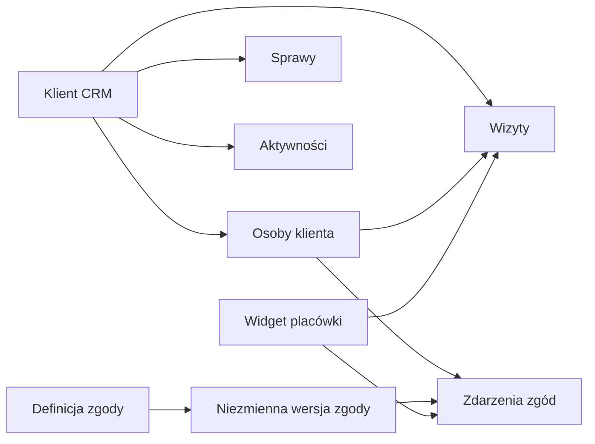

# Moduł klientów, zgód i spotkań

## Cel

Moduł klientów jest centralnym źródłem danych o relacji z klientem. Każda sprawa,
aktywność i wizyta musi wskazywać rekord `crm_clients`. Dane wpisane przy
rezerwacji pozostają na wizycie jako historyczny snapshot, ale nie zastępują
obiektu klienta.

## Niezmienniki

- `crm_clients` jest kanonicznym obiektem klienta w obrębie organizacji.
- `crm_client_people` przechowuje osoby i role, np. klient główny lub
  współkredytobiorca.
- Każda nowa wizyta ma `client_id` oraz osobę kontaktową, jeśli jest znana.
- Wizyta zachowuje `customer_name`, `customer_email` i `customer_phone` jako
  snapshot z chwili rezerwacji.
- Identyfikatory z różnych organizacji nie mogą zostać ze sobą powiązane;
  relacje używają złożonych kluczy z `organization_id`.
- Treść zgody nigdy nie jest edytowana w miejscu. Nowa treść tworzy nową wersję.
- Decyzje klienta są append-only. Aktualny stan wynika z ostatniego zdarzenia
  dla osoby i definicji zgody.
- Formularz klienta i publiczny widget pobierają wyłącznie aktualne,
  opublikowane wersje zgód dla kontekstu tworzenia klienta.
- Żadna zgoda dobrowolna nie jest zaznaczona domyślnie. Zgoda wymagana blokuje
  zapis, a zgoda kanałowa wymaga właściwego adresu e-mail lub telefonu.

## Powiązanie klienta podczas rezerwacji

### Rezerwacja pracownika

Pracownik wyszukuje istniejącego klienta po nazwie, osobie, e-mailu, telefonie
lub tagu. Może też przejść bezpośrednio do formularza „Nowy klient”. Wizyta jest
tworzona dopiero po wybraniu lub utworzeniu klienta.

### Widget publiczny

1. Widget pobiera aktualny katalog usług, ekspertów i wersji zgód.
2. Użytkownik podaje dane kontaktowe i podejmuje decyzję dla każdej zgody.
3. Transakcja blokuje równoległe rozpoznanie tych samych identyfikatorów w
   organizacji.
4. Istniejący klient jest używany wyłącznie wtedy, gdy podany e-mail i telefon
   wskazują dokładnie ten sam rekord. Sam e-mail nie powoduje automatycznego
   scalenia; powstaje wtedy nowy rekord oznaczony do kontroli duplikatów.
5. Zapisywane są wersjonowane zdarzenia decyzji oraz wizyta wskazująca klienta.
6. Konflikt terminu wycofuje całą transakcję, więc nie pozostawia pustego klienta.

Automatyczne dopasowanie nie scala istniejących duplikatów i nie nadpisuje
danych profilu. Potencjalne duplikaty powinny trafiać do osobnego procesu
łączenia rekordów z audytem. Dane z widgetu oraz dowód zgody są oznaczone jako
`self_declared`; mocniejsze automatyczne scalanie wymaga weryfikacji OTP lub
double opt-in. Rekord otrzymuje też tag `possible-duplicate`, więc można go
odnaleźć istniejącym filtrem tagów.

## Lista i wyszukiwanie klientów

Lista działa po stronie serwera i obsługuje:

- wyszukiwanie pełnotekstowe: nazwa klienta, osoby, e-mail, telefon, tagi,
  źródło i notatki;
- filtry: status, opiekun, źródło, tagi, dostępność e-maila/telefonu, aktualna
  decyzja dla zgody, data utworzenia i modyfikacji;
- sortowanie: ostatnia modyfikacja, data utworzenia i nazwa;
- paginację z deterministycznym drugim kluczem `id`;
- bezpieczne projekcje listy bez pobierania pełnego profilu i historii zgód.

Indeksy obejmują `organization_id` jako pierwszy element, klucze filtrów,
kolumny relacji oraz GIN dla wektora wyszukiwania i tagów.

## Ekrany

### Lista klientów

- jedno główne pole wyszukiwania;
- szybkie filtry statusu i opiekuna;
- panel filtrów zaawansowanych;
- aktywne filtry jako usuwalne znaczniki;
- tabela na desktopie i zwarte karty na urządzeniach mobilnych;
- paginacja serwerowa, stan pusty, stan błędu i szkielety ładowania;
- akcja „Dodaj klienta”.

### Dodawanie klienta

Formularz ma sekcje: dane podstawowe, osoba główna, klasyfikacja i opiekun,
zgody oraz podsumowanie. Katalog zgód jest ładowany przy otwarciu formularza.
Zapis klienta, osoby, wszystkich decyzji i aktywności odbywa się atomowo.

### Karta klienta

Nagłówek pokazuje status, opiekuna i kontakt. Panele obejmują: przegląd, osoby,
sprawy, wizyty, bieżący stan zgód i oś aktywności. Historia zgód pokazuje
dokładną wersję tekstu, decyzję, kanał, źródło, czas i dowód pozyskania.

## Uprawnienia i bezpieczeństwo

- członek organizacji widzi klientów zgodnie z istniejącą polityką CRM;
- administrator organizacji może zmienić opiekuna i zarządzać definicjami zgód;
- zapis klienta ze zgodami jest pojedynczą operacją bazodanową;
- publiczny widget korzysta wyłącznie z serwerowego API i minimalnych RPC;
- tabele publicznego schematu mają RLS, jawne granty i tenant-safe relacje;
- funkcje uprzywilejowane mają pusty `search_path`, jawne kontrole oraz cofnięte
  domyślne prawo wykonania;
- zewnętrzne kalendarze otrzymują tylko dane potrzebne do wydarzenia. Obiekt
  klienta i historia zgód pozostają w CRM.

## Kryteria akceptacji

- nie da się utworzyć nowej wizyty bez klienta;
- utworzenie klienta bez kompletu aktualnych decyzji zgód kończy się błędem;
- zmiana wersji zgody podczas wypełniania formularza wymaga odświeżenia decyzji;
- wyszukiwanie i wszystkie filtry są ograniczone do bieżącej organizacji;
- równoległe rezerwacje z tym samym kluczem idempotencji nie tworzą duplikatów;
- klucz idempotencji obejmuje cały zamiar rezerwacji, w tym decyzje zgód i wynik
  kalkulatora;
- konflikt terminu nie pozostawia osieroconego klienta ani zdarzeń zgód;
- lista klientów pozostaje indeksowalna przy dużej liczbie rekordów.
