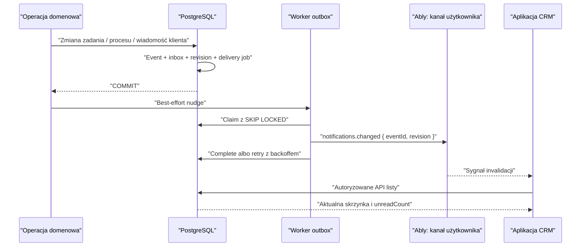

# Powiadomienia użytkownika

Centrum powiadomień OpenExpert jest trwałą, organizacyjną skrzynką odbiorczą
dla pracownika. PostgreSQL pozostaje źródłem prawdy, a transport realtime jest
wyłącznie przyspieszeniem, które informuje klienta, że powinien ponownie pobrać
autoryzowany widok danych.

## Niezmienniki

- Odbiorcę zawsze identyfikuje para `(organization_id, recipient_user_id)`.
  `users.organization_id` nie jest źródłem autoryzacji.
- Utworzenie zdarzenia, wpisu w skrzynce, zwiększenie rewizji i wpis do outboxa
  odbywają się w jednej transakcji z operacją domenową.
- Event biznesowy jest idempotentny. Ponowienie tego samego `dedupe_key` nie
  tworzy drugiego powiadomienia, a użycie klucza dla innej treści jest błędem.
- Powiadomienie jest uznawane za wysłane in-app po zatwierdzeniu rekordu
  `user_notifications`. Ably nie decyduje o trwałości ani dostępności danych.
- Wiadomość realtime nie zawiera tytułu, treści, danych klienta, identyfikatora
  sprawy ani organizacji. Zawiera wyłącznie wersję kontraktu, rodzaj sygnału,
  identyfikator joba i monotoniczną rewizję skrzynki.
- Odczyt jest monotoniczny. Użytkownik nie może przez bezpośredni dostęp do
  tabel zmieniać odbiorcy, treści zdarzenia ani statusu dostawy.
- „Oznacz wszystkie” używa znacznika czasu widoku. Powiadomienia utworzone po
  otwarciu listy nie są przypadkowo oznaczane jako przeczytane.

## Model danych

| Relacja | Odpowiedzialność |
| --- | --- |
| `notification_events` | Niezmienny, wersjonowany fakt biznesowy i bezpieczny payload szablonu. |
| `user_notifications` | Trwały wpis skrzynki jednego członka organizacji wraz ze stanem odczytu. |
| `notification_inbox_states` | Monotoniczna rewizja skrzynki używana do rekoncyliacji klientów. |
| `notification_delivery_jobs` | Transakcyjny outbox z lease, retry i idempotencją transportu. |

Event i wpis odbiorcy są rozdzielone, ponieważ jedno zdarzenie może docelowo
trafić do wielu osób i przez wiele kanałów. Payload zawiera dane potrzebne do
wyrenderowania konkretnej wersji szablonu, ale nie pełne rekordy domenowe ani
treść wiadomości klienta. Kanały rozwiązują aktualny, zweryfikowany adres
e-mail lub numer telefonu dopiero w chwili dostawy.

## Przepływ dostawy



Jeżeli Ably nie jest skonfigurowane, job realtime jest kończony jako obsłużony,
ponieważ wybranym transportem jest polling. Przy aktywnym Ably klient nadal
wykonuje okresowy safety poll. Po odzyskaniu sieci, focusie karty i attachu
kanału zawsze następuje pełna rekoncyliacja z API.

## Kanał realtime i dostęp

Kanał jest prywatny dla jednej organizacji i jednego użytkownika:

```text
openexpert:organization:{organizationId}:notifications:user:{userId}:v1
```

Endpoint tokenu nie przyjmuje identyfikatora użytkownika. Wyprowadza go z
uwierzytelnionej sesji i nadaje krótkotrwałą capability `subscribe` wyłącznie
do dokładnej nazwy kanału. Prefiks kanału nie jest zabezpieczeniem sam w sobie;
izolację zapewnia capability tokenu i ponowna kontrola członkostwa przez API.

Tabele eventów i jobów są dostępne wyłącznie dla `openexpert_service`.
Użytkownik odczytuje i oznacza własne powiadomienia przez ograniczone RPC.
Każda relacja odbiorcy ma złożony klucz obcy do
`organization_memberships(organization_id, user_id)` oraz RLS.

## Pierwszy katalog zdarzeń

- `crm.case_message.received` — klient wysłał wiadomość właścicielowi sprawy;
- `crm.task.delegated` — użytkownik otrzymał delegowane zadanie;
- `crm.task.accepted`, `crm.task.rejected`, `crm.task.cancelled` — decyzja o
  delegacji;
- `crm.task.completed` — delegowane zadanie zostało ukończone;
- `crm.case_item_handoff.requested` — prośba o przejęcie procesu sprawy;
- `crm.case_item_handoff.accepted`, `crm.case_item_handoff.rejected`,
  `crm.case_item_handoff.cancelled` — wynik przekazania procesu.

Każdy typ ma `schema_version`. Zmiana znaczenia payloadu wymaga nowej wersji
szablonu, dzięki czemu historyczne wpisy nadal dają się wyrenderować.

## API i zachowanie klienta

- lista używa paginacji keyset po `(created_at DESC, id DESC)` i zwraca
  autorytatywny `unreadCount`, rewizję oraz watermark;
- kliknięcie wpisu oznacza go jako przeczytany i prowadzi tylko do względnej,
  organizacyjnej ścieżki wygenerowanej przez serwer;
- otwarcie panelu nie oznacza wpisów jako przeczytane;
- stan klienta jest izolowany przez organizację i użytkownika oraz czyszczony
  przy zmianie organizacji lub wylogowaniu;
- panel pokazuje krótki wycinek, a pełna strona korzysta z paginacji kursorowej.

## Kolejne kanały

E-mail, SMS i web push są osobnymi adapterami `notification_delivery_jobs`.
Każdy kanał ma własny job, liczbę prób, status i identyfikator providera, dzięki
czemu awaria SMS-a nie ponawia wysłanego wcześniej e-maila. Przed ich włączeniem
należy dodać preferencje per użytkownik, typ zdarzenia i kanał, quiet hours oraz
reguły agregacji. Ważne zdarzenia mogą korzystać z eskalacji, np. in-app od razu,
e-mail po kilku minutach bez odczytu, a SMS tylko dla jawnie dozwolonych klas.

## Konfiguracja i obserwowalność

```dotenv
NUXT_NOTIFICATIONS_ABLY_API_KEY=app.key:secret
NUXT_NOTIFICATIONS_OUTBOX_SECRET=long-random-secret
OPENEXPERT_NOTIFICATION_OUTBOX_URL=https://crm.example.com/api/internal/notifications/outbox
```

Klucz i sekret są wyłącznie server-side. Można użyć wspólnego klucza Ably i
sekretu messaging jako fallbacku, ale osobne credentials zmniejszają blast
radius. W produkcji należy mierzyć co najmniej:

- wiek najstarszego pending/failed joba i liczbę prób;
- odsetek błędów tokenu oraz publikacji Ably;
- udział klientów pracujących w fallback polling;
- czas od commitu eventu do pojawienia się w UI;
- rozmiar skrzynki, liczbę unread i skuteczność indeksów zapytań feedu.

Deploy wymaga kolejno migracji bazy, aplikacji CRM i workera outbox. Test awarii
powinien odciąć Ably, utworzyć zdarzenie, potwierdzić widoczność przez polling,
przywrócić transport i sprawdzić opróżnienie kolejki bez duplikatów.
